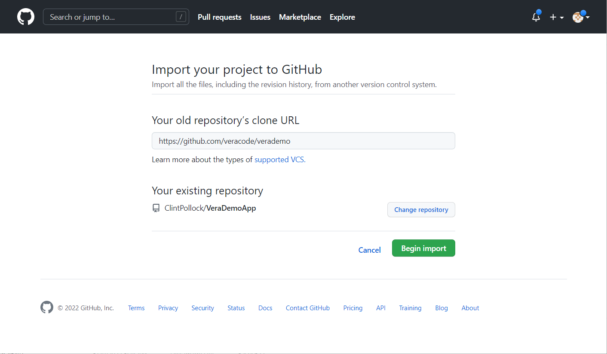
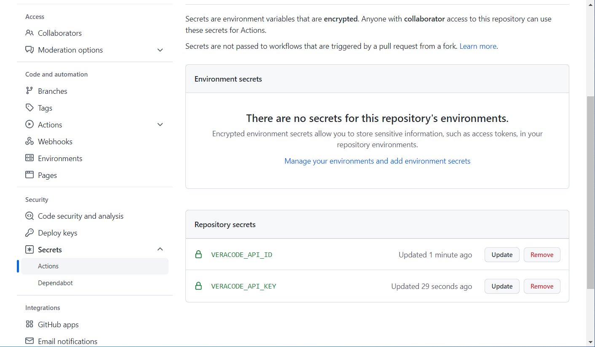
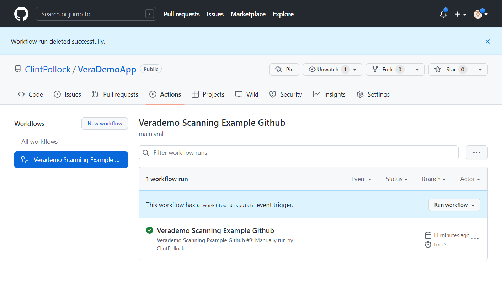
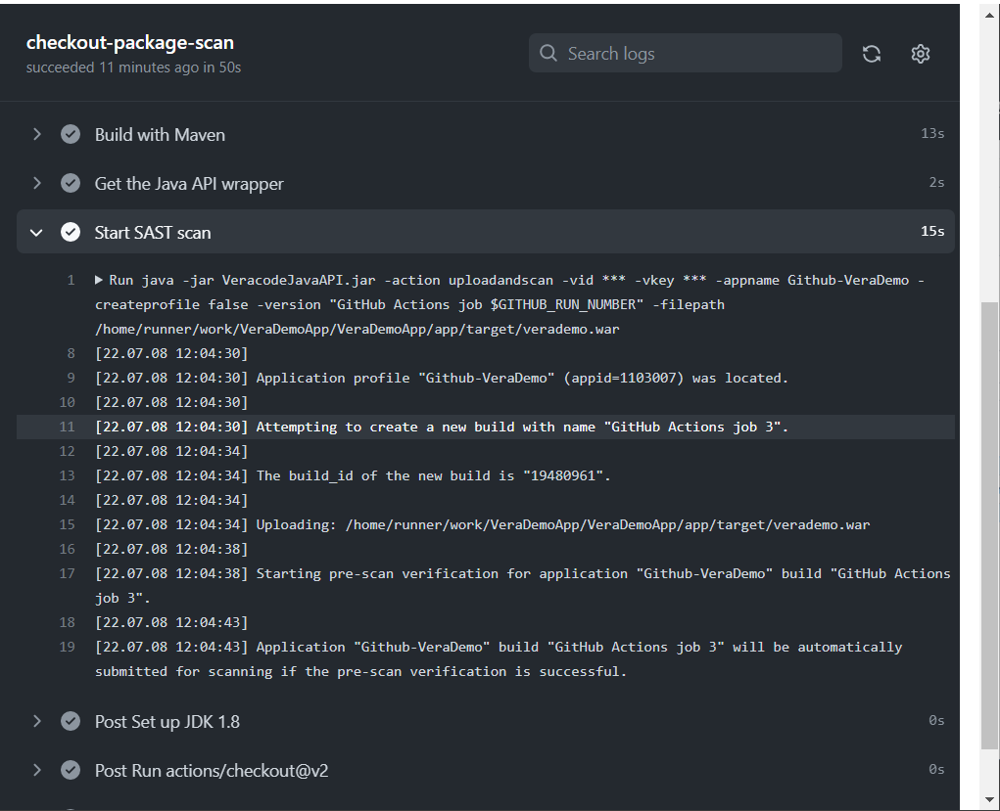

[Return to Index](/index.md)

# Veracode-GitHub-Getting-Started-Guide
How to get started with Veracode security scanning in GitHub.

For this example we will demonstrate a Static + Software Composition Analysis Policy scan.

We can use VeraDemoJava for this example.

https://github.com/veracode-demo-labs/verademo

## Process to Scan
* Checkout code
* Build code / create artifact
* Scan


## Configuration Steps
* Create project
* Import code
* Create API key variables
* Paste in example yml 

### Getting Started
Create a new project, click Repos, and then click Import.  


Click Import


Import repository https://github.com/veracode-demo-labs/verademo



Click Settings - New Repository Secret.  Add VID and VKEY with your Veracode API Credentials.


Should look like this -



Click setup new workflow yourself.


Copy in this YML


```bash
name: Verademo Scanning Example Github

on:
  workflow_dispatch:
  repository_dispatch:
    types: [test]

jobs:
  checkout-package-scan:

    runs-on: ubuntu-latest

    steps:
    - uses: actions/checkout@v2
    - name: Set up JDK 1.8
      uses: actions/setup-java@v1
      with:
        java-version: 1.8
  
    - name: Build with Maven
      run: mvn -f app/pom.xml clean package 

    - name: Get the Java API wrapper
      uses: wei/curl@master
      with:
        args: -sS -o VeracodeJavaAPI.jar "https://repo1.maven.org/maven2/com/veracode/vosp/api/wrappers/vosp-api-wrappers-java/19.6.5.8/vosp-api-wrappers-java-19.6.5.8.jar"

    - name: Start SAST scan
      run: java -jar VeracodeJavaAPI.jar -action uploadandscan -vid ${{ secrets.VERACODE_API_ID }} -vkey ${{ secrets.VERACODE_API_KEY }} -appname Github-VeraDemo -createprofile true -version "GitHub Actions job $GITHUB_RUN_NUMBER" -filepath ./app/target/verademo.war
```


Commit the Action


Go into Actions, and then Run the Workflow



The Workflow should complete



You can review the logs and see that the scan has been submitted.


Login to the Veracode platform and review results.

## To go further, visit -

https://github.com/veracode/Veracode-manual-for-GitHub