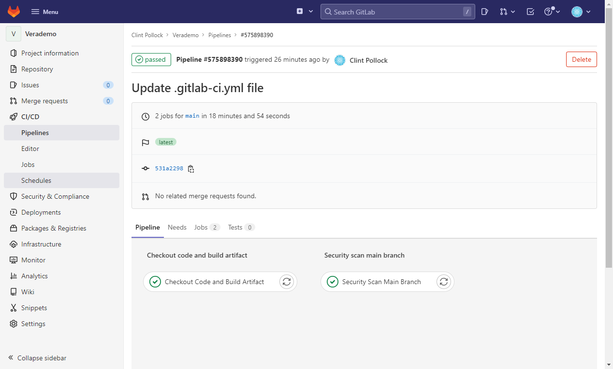
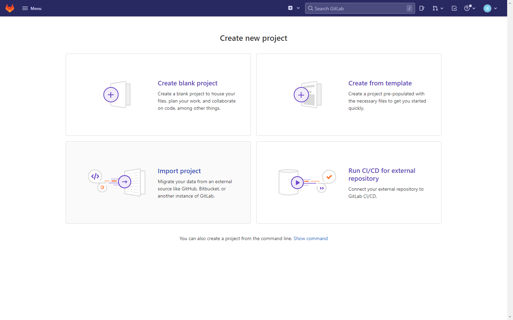
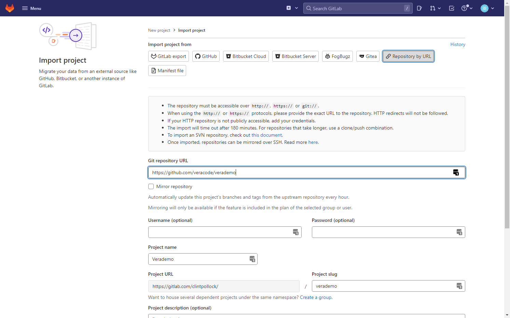
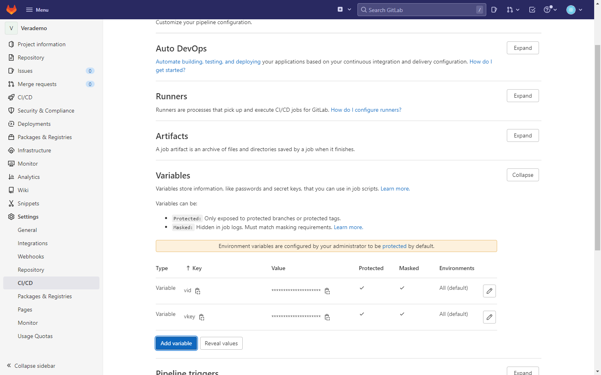
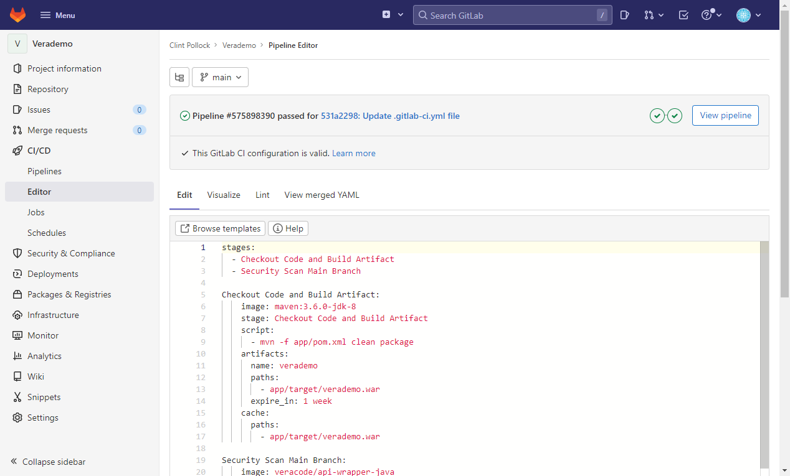
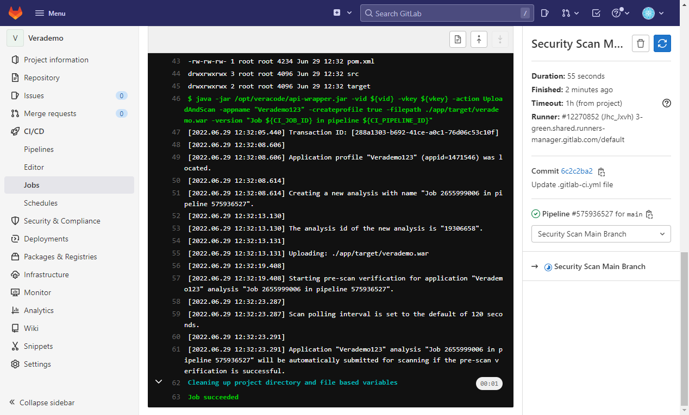

[Return to Index](/)  |  [Return to GitHub/Veracode-Demo-Labs](https://github.com/veracode-demo-labs)

# Veracode-GitLab-Getting-Started-Guide
How to get started with Veracode security scanning in GitLab.

For this example we will demonstrate a Static + Software Composition Analysis Policy scan.

We can use VeraDemoJava for this example.

https://github.com/veracode-demo-labs/verademo

## Process to Scan
* Checkout code
* Build code / create artifact
* Scan




## Configuration Steps
* Create project
* Import code
* Create API key variables
* Paste in example yml 

### Getting Started
Create a new project, click Repos, and then click Import.  



Import code from:

https://github.com/veracode-demo-labs/verademo



Click Settings, CI/CD, and then find the Variables section to add your Veracode vid and vkey.



Create Pipeline and import below yml



```bash
stages:
  - Checkout Code and Build Artifact
  - Security Scan Main Branch

Checkout Code and Build Artifact:
    image: maven:3.6.0-jdk-8
    stage: Checkout Code and Build Artifact
    script:
      - mvn -f app/pom.xml clean package 
    artifacts:
      name: verademo
      paths:
        - app/target/verademo.war
      expire_in: 1 week
    cache:
      paths:
        - app/target/verademo.war

Security Scan Main Branch:
    image: veracode/api-wrapper-java
    stage: Security Scan Main Branch
    only:
        - main
    script:
        - ls -la
        - ls -la app
        - java -jar /opt/veracode/api-wrapper.jar -vid ${vid} -vkey ${vkey}
          -action UploadAndScan -appname "Verademo123" -createprofile true 
          -filepath ./app/target/verademo.war -version "Job ${CI_JOB_ID} in pipeline ${CI_PIPELINE_ID}" 
```

Once you save the GitLab Pipeline it will checkout the code, build and artifact the app, and then submit the application for a Static + Software Composition Analysis scan.  



Check the platform to review the results.

## To go further, visit -

https://gitlab.com/veracode-gitlab-manual/veracode-manual-for-gitlab