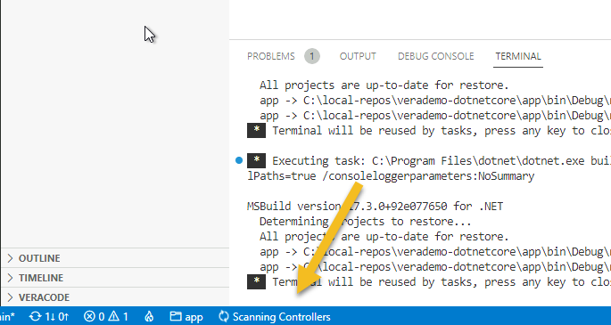
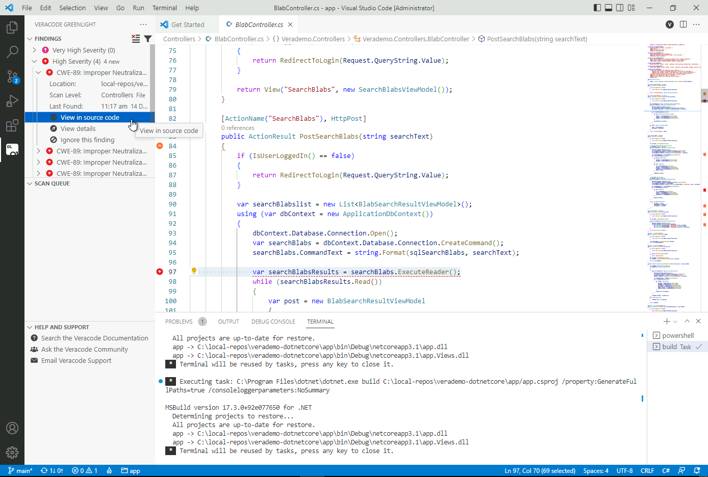
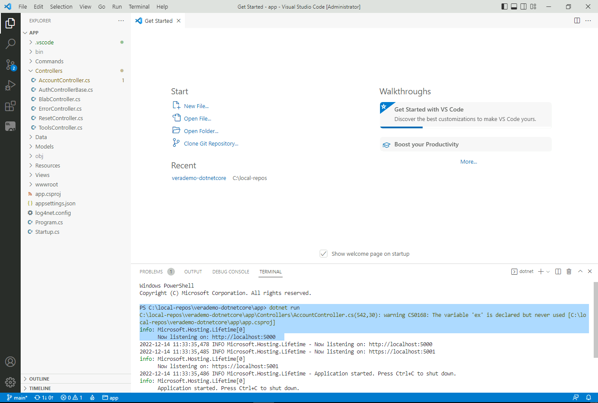
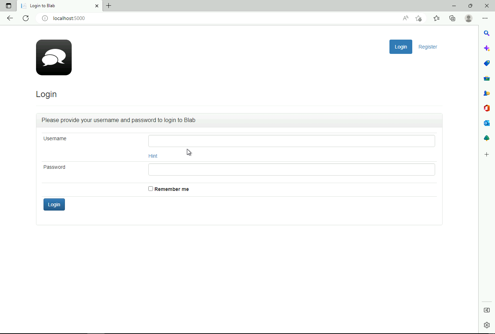

[Return to Home](/)  |  [Return to GitHub/Veracode-Demo-Labs](https://github.com/veracode-demo-labs)

# Visual Studio Code

VS Code is configured to open with the VeraDemo-DotNetCore project.

## Overview

After opening VS Code, run a "dotnet build" command in the terminal.  Your project should properly build before continuing.

Right-click on the Controllers folder and select Scan with Greenlight.

You'll see in the bottom left that Greenlight in scanning the folder "Controllers".

Review the results in the left column.

You can run this app by typing in "dotnet run" in the terminal.

If you browse to http://localhost:5000 the app should appear.

[Return to Home](/)  |  [Return to GitHub/Veracode-Demo-Labs](https://github.com/veracode-demo-labs)