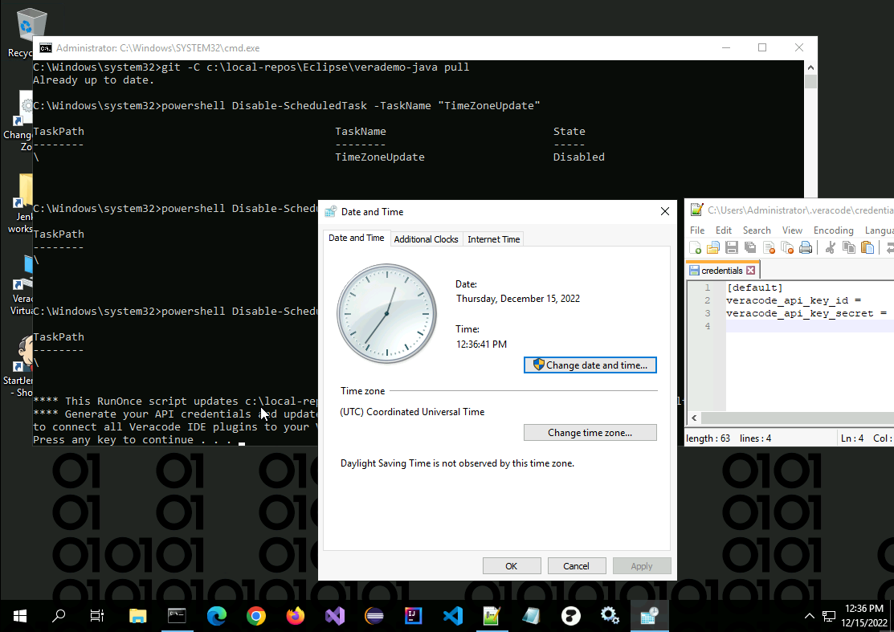
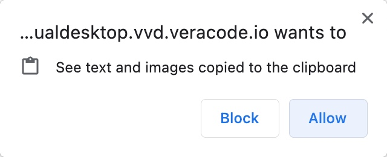
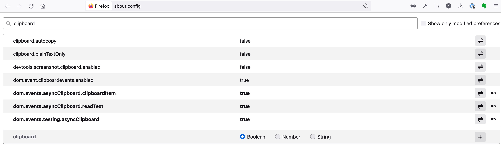

[Return to Home](/)  |  [Return to GitHub/Veracode-Demo-Labs](https://github.com/veracode-demo-labs)

## Welcome to your Veracode Virtual Desktop

###  Upon first login, set your timezone, and enter your API keys.

#### Copy/Paste Notes
Copy/Paste between your desktop machine and the VVD machine has security implications, in that you're allowing a website to write to the system clipboard.  As such, copy/paste does not work exactly as you might expect.  The Terminal Server (Guacamole) implements the modern Clipboard API, which is handled differently by various browsers.  For some background, see [here](https://guacamole.apache.org/faq/#local-clipboard)

##### Chrome
Normal copy/paste will work in Chrome, if you allow this.  You will get a pop-up when you initially connect asking if you want to allow the virtual desktop to "See text and images copied to the clipboard" (see pic below).  If you click 'Allow' copy/paste will work as expected.  If you don't want to allow this, see the default settings below.

##### Firefox
By default, Firefox (as of version 106) does not automatically support the Clipboard API, but there are some developer settings that will enable this.  To enable support for the Clipboard API, type `about:config` in Firefox's URL box, click 'Accept the Risk and Continue', and then search for "clipboard".  Toggle the following fields to 'true' (you'll probably need to at least reload the page or possibly restart Firefox).

##### Safari
At this time Safari (version 15.6.1) does not support the Clipboard API.  See the Default operation below.

##### Default
The default way of doing copy/paste is to use the Guacamole sidebar menu.  Type CTRL-SHIFT-ALT (CTRL-SHIFT-CMD on Mac) to access the Guacamole menu.  Copying text from your local system into the Clipboard on the Guacamole menu will place it in the remote system's clipboard.  And when working on the remote system and copying text into the remote clipboard it will also appear in the Guacamole menu.  More info on the Guacamole menu is available [here](https://guacamole.apache.org/doc/gug/using-guacamole.html#client-screen)
